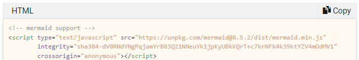
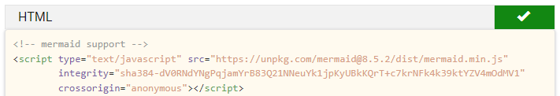

# Copy code button

Styling and a script was added to show a "Copy Code" button on code blocks in the browser. You can see the result below.



Once you have copied the code, the button is checked:



## The real thing

On the website you can try it yourself:

```csharp
using System;

namespace HelloWorld
{
    class Program
    {
        static void Main(string[] args)
        {
            Console.WriteLine("Hello World!");
        }
    }
}
```
