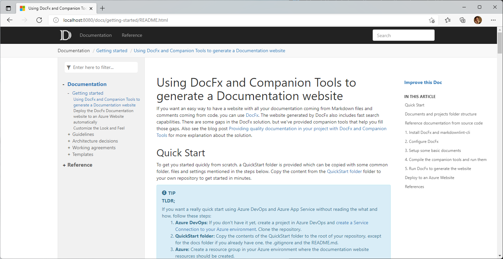
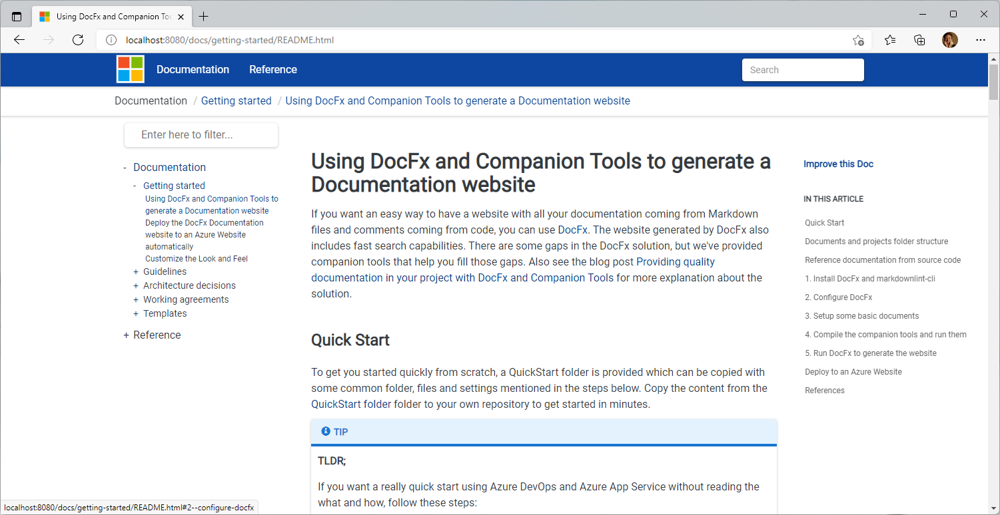
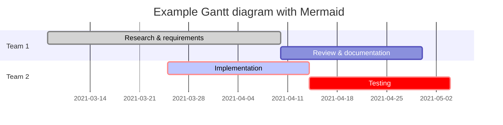
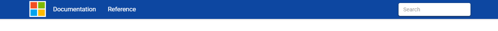

# Customize the Look and Feel

If you don't configure it, DocFx will generate a website with an out-of-the-box template. The website for this Quick Start is then generated to this:



For this website we created a custom template with a few extra's. That results in this look-and-feel:



In **docs\\.docfx\template** you can find the custom template for generating the documentation website. The basic template is first referenced in **docfx.json** to apply the defaults. As second template our custom template is configured. This will add or overwrite files of the default, in our case at least *main.css*. In the template we also enabled diagram support through [Mermaid](https://mermaid.js.org) in *scripts.tmpl.partial*.

## Material design

We chose the [DocFx Material Theme](https://ovasquez.github.io/docfx-material/) as a starting point of our custom template. The Material.zip was downloaded and extracted. It contains a modified **styles\main.css**.

## Mermaid support

To enable the rendering of [Mermaid](https://mermaid-js.github.io/mermaid/#/) diagrams in the documentation website, the code below can be added to **partials\scripts.tmpl.partial**.

```html
<!-- Support for diagrams (Mermaid). See https://mermaid.js.org/intro/n00b-gettingStarted.html -->
<script type="module">
    import mermaid from 'https://cdn.jsdelivr.net/npm/mermaid@10/dist/mermaid.esm.min.mjs';
    mermaid.initialize({ startOnLoad: true });
</script>
```

By adding this, mermaid diagrams are rendered in the website.

A sample Mermaid diagram could be something like:

<!-- markdownlint-disable MD040 -->
````
gantt
 title Example Gantt diagram with Mermaid
    dateFormat  YYYY-MM-DD
    section Team 1
    Research & requirements :done, a1, 2021-03-08, 2021-04-10
    Review & documentation : after a1, 20d
    section Team 2
    Implementation      :crit, active, 2021-03-25  , 20d
    Testing      :crit, 20d
````
<!-- markdownlint-enable MD040 -->

which will be rendered as:



## 'Copy code'-button

It can be desirable to have a copy button on code blocks to copy the contents to the clipboard for easy re-use. We have added this solution to the template for the website. In the **Styles** folder two files were added: **copyCodeButton.css** and **copyCodeButton.js**. In **partials\scripts.tmpl.partial** the JavaScript file is referenced:

```html
...
<script type="text/javascript" src="{{_rel}}styles/copy-code-button.js"></script>
...
```

And in **partials\head.tmpl.partial** the CSS file is referenced:

```html
...
  <link rel="stylesheet" href="{{_rel}}styles/copy-code-button.css">
...
```

When this is added, code blocks will have a Copy-button like this:


When a user clicks the Copy-button, the contents is copied into the clipboard and the icon changes for some time to indicate the copy was succesfull:


## The Logo



The logo of the website is **images\logo.png**. The configuration is done in docfx.json for both the logo to use and the favorite icon to use like this:

```json
    "globalMetadata": {
      "_appTitle": "QuickStart Documentation",
      "_appName": "QUickStart Documentation",
      "_appLogoPath": "images/logo.png",
      "_appFaviconPath": "images/favicon.ico",
      "_enableSearch": true,
      "_enableNewTab": true
    }
```

## Header Bar Color

If you want to change the color of the header bar, open **styles\main.css** and modify the **--header-bg-color** value. If you want to make sure it's a web safe color, you can use a website like [Color Tools.NET](https://www.colortools.net/color_make_web-safe.html) to make your selected color web safe.
