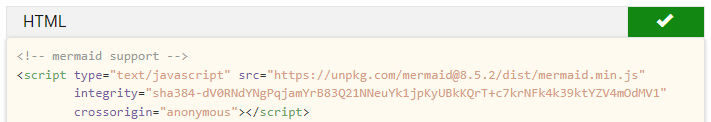

# Customize the Look and Feel

If you don't configure it, DocFx will generate a website with an out-of-the-box template. The website for this Quick Start is then generated to this:


For this website we created a custom template with a few extra's. That results in this look-and-feel:


In **DocFx\templates** you can find custom templates for generating the documentation website and PDF. The basic template is first referenced in **docfx.json** to apply the defaults. As second template our custom template is configured. This will add or overwrite files of the default.

## Material design

We chose the [DocFx Material Theme](https://ovasquez.github.io/docfx-material/) as a starting point of our custom template. The Material.zip was downloaded and extracted. It contains a modified **styles\main.css** and a modified **partials\head.tmpl.partial**.

> [!WARNING]
>
> In the unique case the default template of a newer DocFx version would be changed, this custom overwrite template might cause problems or parts being ignored. If you see strange behavior, Check the custom parts with the parts from the default template. More information can be found in [How-to: Create A Custom Template](https://dotnet.github.io/docfx/tutorial/howto_create_custom_template.html).

## Mermaid support

To enable the rendering of [Mermaid](https://mermaid-js.github.io/mermaid/#/) diagrams in the documentation website, the code below is added to **partials\scripts.tmpl.partial**.

```html
<!-- mermaid support -->
<script type="text/javascript" src="https://unpkg.com/mermaid@8.5.2/dist/mermaid.min.js"
        integrity="sha384-dV0RNdYNgPqjamYrB83Q21NNeuYk1jpKyUBkKQrT+c7krNFk4k39ktYZV4mOdMV1"
        crossorigin="anonymous"></script>
<script>
    mermaid.initialize({
        startOnLoad: false
    });
    mermaid.init(undefined, ".lang-mermaid");
</script>
```

By adding this, mermaid diagrams are rendered in the website.

A sample Mermaid diagram could be something like:

<!-- markdownlint-disable MD040 -->
````
gantt
 title Example Gantt diagram with Mermaid
    dateFormat  YYYY-MM-DD
    section Team 1
    Research & requirements :done, a1, 2021-03-08, 2021-04-10
    Review & documentation : after a1, 20d
    section Team 2
    Implementation      :crit, active, 2021-03-25  , 20d
    Testing      :crit, 20d
````
<!-- markdownlint-enable MD040 -->

which will be rendered as:


> [!WARNING]
>
> Currently this doesn't work for the generation of a PDF!

## 'Copy code'-button

It can be desireable to have a copy button on code blocks to copy the contents to the clipboard for easy re-use. We have added this solution to the template for the website. In the **Styles** folder two files were added: **copyCodeButton.css** and **copyCodeButton.js**. In **partials\scripts.tmpl.partial** the JavaScript file is referenced:

```html
...
<script type="text/javascript" src="{{_rel}}styles/docfx.js"></script>
<script type="text/javascript" src="{{_rel}}styles/copyCodeButton.js"></script>
<script type="text/javascript" src="{{_rel}}styles/main.js"></script>
...
```

And in **partials\head.tmpl.partial** the CSS file is referenced:

```html
...
  <link rel="stylesheet" href="{{_rel}}styles/docfx.css">
  <link rel="stylesheet" href="{{_rel}}styles/copyCodeButton.css">
  <link rel="stylesheet" href="{{_rel}}styles/main.css">
...
```

When this is added, code blocks will have a Copy-button like this:


When a user clicks the Copy-button, the contents is copied into the clipboard and the icon changes for some time to indicate the copy was succesfull:



## The Logo


The logo of the website is **logo.svg** in the root of the template folder. This can be overwritten with your own logo.

If you want to use your own logo, you need a SVG format of your logo. If you have another format, use a website like [Convertio](https://convertio.co/png-svg/) to upload a PNG and have it converted to an SVG that can be downloaded.

If you have an SVG but it's not the right size, you can use a website like [I♥️IMG](https://www.iloveimg.com/resize-image/resize-svg) to resize it. You can upload your SVG and set the size to 48x48 pixels and click **Resize IMAGES**. The image is then downloaded.

Put your logo.svg in the root of the template folder.

## Header Bar Color

If you want to change the color of the header bar, open **styles\main.css** and modify the **--header-bg-color** value. If you want to make sure it's a web safe color, you can use a website like [Color Tools.NET](https://www.colortools.net/color_make_web-safe.html) to make your selected color web safe.

## PDF Header Styling

If you want to change the color of the **Table of Contents** box, open the **toc.html.tmpl** in the root of the **PDF** template.
