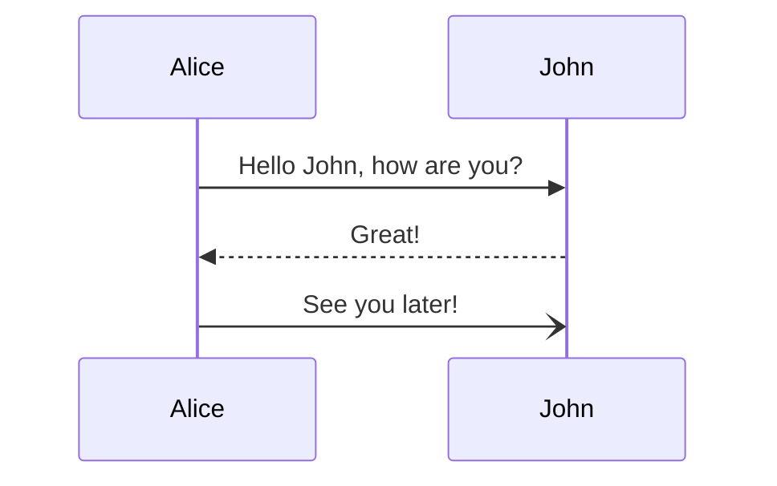
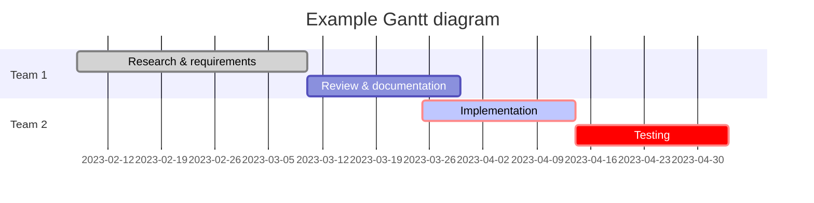
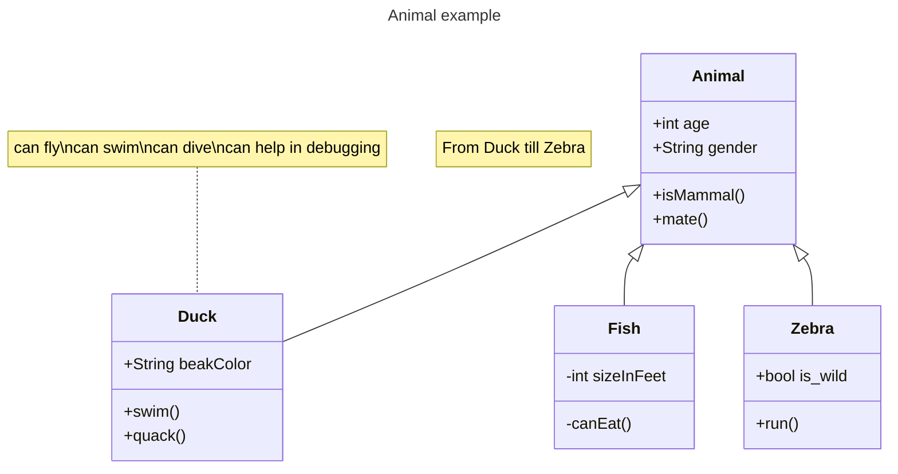
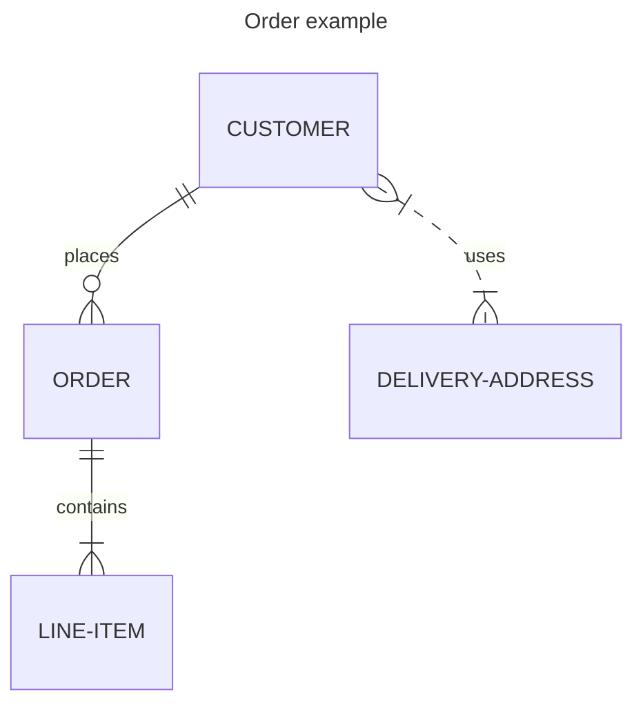
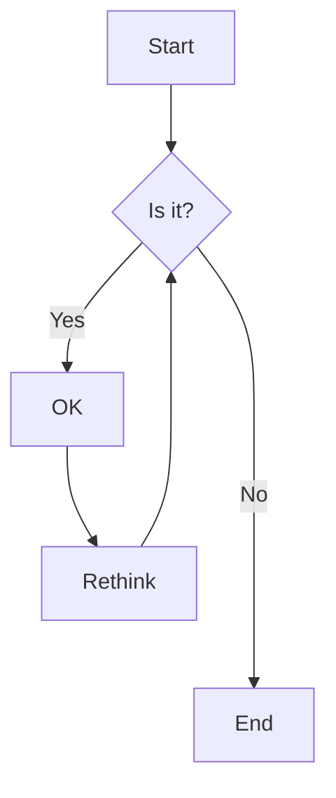

# Using Mermaid

[Mermaid](https://mermaid.js.org/) can be used to generate all kinds of diagrams. Here are a few examples.

## Sample Sequence diagram

```markdown
    ```mermaid
    sequenceDiagram
        Alice->>John: Hello John, how are you?
        John-->>Alice: Great!
        Alice-)John: See you later!
    ```
```



## Sample Gantt diagram

```markdown
    ```mermaid
    gantt
    title Example Gantt diagram
        dateFormat  YYYY-MM-DD
        section Team 1
        Research & requirements :done, a1, 2023-02-08, 2023-03-10
        Review & documentation : after a1, 20d
        section Team 2
        Implementation      :crit, active, 2023-03-25  , 20d
        Testing      :crit, 20d
    ```
```



## Sample Class diagram

```markdown
    ```mermaid
    ---
    title: Animal example
    ---
    classDiagram
        note "From Duck till Zebra"
        Animal <|-- Duck
        note for Duck "can fly\ncan swim\ncan dive\ncan help in debugging"
        Animal <|-- Fish
        Animal <|-- Zebra
        Animal : +int age
        Animal : +String gender
        Animal: +isMammal()
        Animal: +mate()
        class Duck{
            +String beakColor
            +swim()
            +quack()
        }
        class Fish{
            -int sizeInFeet
            -canEat()
        }
        class Zebra{
            +bool is_wild
            +run()
        }
    ```
```



## Sample Entity Relationship diagram

```markdown
    ```mermaid
    ---
    title: Order example
    ---
    erDiagram
        CUSTOMER ||--o{ ORDER : places
        ORDER ||--|{ LINE-ITEM : contains
        CUSTOMER }|..|{ DELIVERY-ADDRESS : uses
    ```
```



## Sample Flowchart diagram

```markdown
    ```mermaid
    flowchart TD
        A[Start] --> B{Is it?}
        B -->|Yes| C[OK]
        C --> D[Rethink]
        D --> B
        B ---->|No| E[End]
    ```
```


