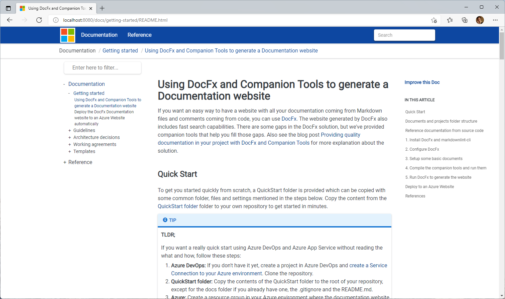

# Quick Start for Using DocFx and Companion Tools to generate a Documentation website

If you want an easy way to have a website with all your documentation coming from Markdown files and comments coming from code, you can use [DocFx](https://dotnet.github.io/docfx/). The website generated by DocFx also includes fast search capabilities. There are some gaps in the DocFx solution, but we've provided companion tools that help you fill those gaps. Also see the blog post [Providing quality documentation in your project with DocFx and Companion Tools](https://mtirion.medium.com/providing-quality-documentation-in-your-project-with-docfx-and-companion-tools-76aed42b1ddd) for more explanation about the solution.

## Quick Start

To get you started quickly from scratch, a QuickStart folder is provided to get you started quickly. This way you can focus on the documentation 😁. If you want to get started quickly in your own repo, follow these steps:

1. From the **QuickStart** folder copy these folders and files to *the root* your own repo:
   * **.markdownlint.json** - a configuration file for *markdownlint*.
   * **GenerateDocWebsite.cmd [OPTIONAL]** - a helper command file to go through the complete process of 1) run markdownlint 2) check links with DocLinkChecker 3) generate table of contents with DocFxTocGenerator and 4) generate the website using DocFx.

   * **docs\docfx.json** - The configuration for DocFx to generate a website.

     > [!NOTE]
     > The build.content.files section references specific folders from this repo. You can change the list to your structure.

   * **docs\\.docfx** - templates, cross reference configuration.

     > [!NOTE]
     >
     > The .docfx\x-cross\toc.yml file references specific folders from this repo. You can change this to your structure.

   * **docs\toc.yml** - this is the definition file for the top navigation of the website.

      > [!NOTE]
      > The docs\toc.yml file references specific folders from this repo. You can change this to your structure.

   * **docs\index.md [OPTIONAL]** - this is the start file for the website. If you have your own index.md you don't need this.

2. Some **optional** actions:

   * **.gitignore** - If you don't have a .gitignore yet, you can use this one which is based on a standard .NET Core ignore file. If you already have a .gitignore, please add this part to it, as those folders and files are generated by the process:

     ```yaml
     # DocFx generated files
     /docs/**/toc.yml
     /docs/reference/
     _site
     ```

     > [!NOTE]
     >
     > Make sure you add **docs\toc.yml** and **docs\\.docfx\x-cross\toc.yml** manual to your git repo using `git add [file] -f`. Otherwise you'll miss these files in the repo, preventing a good generation of the website. This files are edited manually.

   * **docs\web.config** - copy this file as well if you want to deploy to an IIS website. The is also a redirect configured, but as comment. If you need an automatic redirect from the root folder you can uncomment this and tailor it to your needs.

   * If you have taken care of the steps above, you can run the **GenerateDocWebsite.cmd** command file to generate the website. If you want to test the website on your local machine, you can add the **--serve** attribute to start a local web site on **<http://localhost:8080>**.

> [!NOTE]
>
> The *DocFx\GenerateDocWebsite.cmd* expects the [DocFx Companion Tools](https://github.com/Ellerbach/docfx-companion-tools) to be installed. See the [docfx-companion-tools repo](https://github.com/Ellerbach/docfx-companion-tools#install) for the options to install. 
>

## Publish the Documentation

Now you have the documentation, you can automate the publication process in an Azure DevOps pipeline or GitHub Actions workflow. There are examples for these in the *samples* folder. See [Deploy the DocFx Documentation website to an Azure Website automatically](./deploy-docfx-azure-website.md) for a walkthrough how to deploy from an Azure DevOps pipeline to an Azure Web App.

This is the result if you publish all the content of the quick start to a website.



